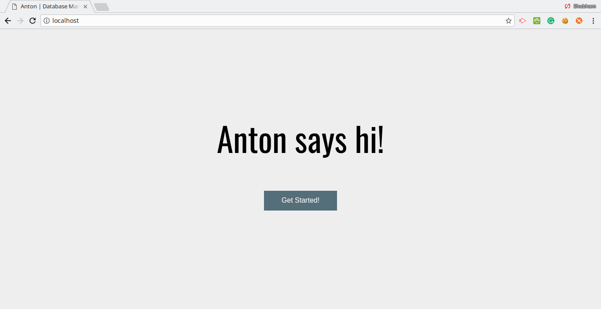
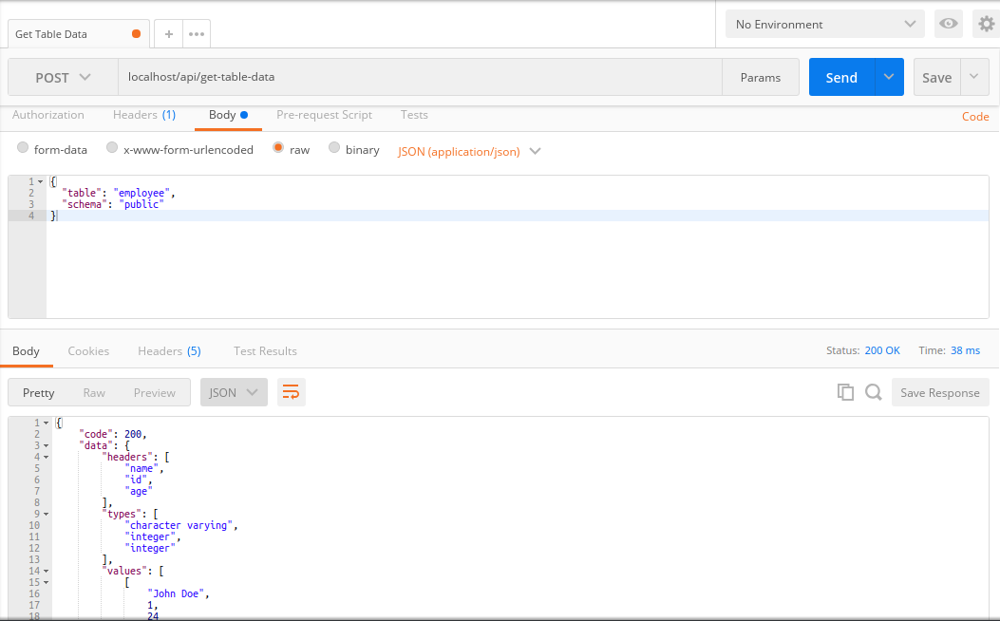
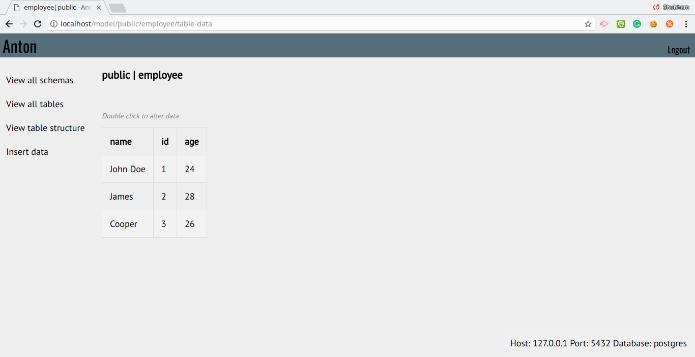

<h1 align="center">  
    Anton  
</h1>  
  
<h4 align="center">A database management tool built on top of <a href="http://flask.pocoo.org/" target="_blank">Flask</a>.</h4>
 
 <p align ="center">
<a href="https://goo.gl/BG4WQy">Abstract</a> | 
<a href="https://goo.gl/XbmUoK"> Documentation |
<a href="#getting-started">Getting started</a> |
<a href="#features">Features</a> |
<a href="#license">License</a>
</p>
  
  

## Getting started

### Prerequisites
* python3
* postgresql (>=9.5 required) 

### Installation  
```sh  
$ git clone https://github.com/shubham1172/anton/  
$ cd anton  
$ pip3 install -r requirements.txt  
```

### Running
```sh
$ python3 app.py
```
The default port is 80. If you want to run it on a different port,
```sh
$ python3 app.py -p [port]
```

## Features
Anton helps you manage databases easily. It supports only PostgreSQL for now.  The functionality is broadly divided into two	use cases:

 - Anton for developers
	 - Anton helps developers use databases in their apps without any hassles.
	 - With the rich API, any developer can get started with using a postgres database.
	 
- Anton for SQLphobic users
	- Anton provides a simple web interface to  interact with data. No more SQLing.
	- Easy to use UI makes life easy for Anton users.


The complete list of features can be found in the [documentation](https://goo.gl/XbmUoK).

## License
Anton is licensed under the [GNU General Public License v2.0](https://github.com/shubham1172/anton/blob/master/LICENSE).
